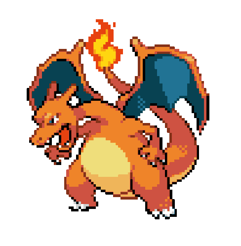
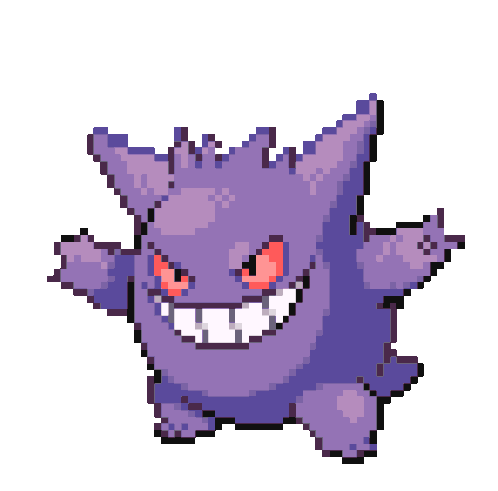
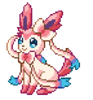
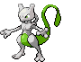
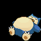
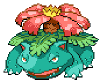
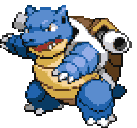

# Pokémon Browser Pet

> A little Pokémon that lives in your browser.

A Chrome Manifest V3 extension that drops Pokémon companions onto every page.
Each one roams the whole viewport — walking, climbing and gliding diagonally —
turns around at the screen edges, idles and breathes when it has nothing to do,
naps after a while, and hops with a speech bubble and a cry when you click it.
**Drag one anywhere** to reposition it.

Tick as many Pokémon as you like in the popup and they all show up **at the
same time**, each wandering independently. Switch on the **3D scene** and a
Pokémon Center diorama sits on the page for the pets to walk around inside —
drag the house anywhere, and **triple-click it for an earthquake**.

This is the MVP from `pokemon_browser_pet_plan.pdf` — walk + turn + idle + click
+ settings, Charizard first.

## Characters

The sprites shipped in `assets/icons/pokemon/icons/`. These are the live GIFs
the extension renders — what you see here is exactly what walks across your
page. Any combination of them can be on screen together.

| Sprite | Pokémon | Box | Speed | Art faces | Cry |
| :----: | ------- | --: | ----: | :-------: | :-: |
|  | **Charizard** | 104px | 58px/s | ◀ | 🔊 |
|  | **Gengar (Shiny)** | 96px | 46px/s | ◀ | 🔊 |
|  | **Sylveon** | 84px | 52px/s | ◀ | 🔊 |
|  | **Mewtwo** | 100px | 40px/s | ▶ | 🔊 |
|  | **Snorlax** | 112px | 30px/s | ▶ | 🔊 |
|  | **Venusaur** | 106px | 36px/s | ◀ | 〰️ |
|  | **Blastoise** | 104px | 40px/s | ◀ | 〰️ |

"Box" is the on-screen square the sprite is letterboxed into; the speed is the
character's natural pace at slider position 5. "Art faces" is the direction the
raw sprite looks — the engine flips it horizontally so the pet always faces the
way it is moving. 🔊 means a recorded cry in `assets/icons/pokemon/sounds/`;
〰️ means none ships, so the engine **synthesizes** one (see below).

The whole table lives in **`src/characters.js`**, which both the engine and the
popup read, so the two can never disagree about who exists.

## Install (load unpacked)

1. Open `chrome://extensions`.
2. Turn on **Developer mode** (top right).
3. Click **Load unpacked** and select this folder.
4. Open any site (or `test.html` in this repo) — Charizard appears and starts
   walking. Tick more Pokémon in the popup to add them alongside.

If a tab was already open before installing, reload it.

## Popup settings

Click the toolbar icon:

| Setting    | Effect                                                        |
| ---------- | ------------------------------------------------------------- |
| Show pet   | Enable / disable **all** pets on all pages (live).             |
| Sound      | Play a pet's cry when you click it. On by default.            |
| 3D scene   | Show the diorama on the page and pen the pets inside it. Off by default. |
| Pokémon    | A checkbox per character in `src/characters.js` — **tick any combination** and they all appear together. Unticking every one leaves the page empty. |
| Movement   | **Free roam** (walk · climb · glide) or **Ground only** (↔).  |
| Walk speed | 1–10; 5 is each character's natural pace.                     |
| Size       | 40–150%. Scales the pets **and** the diorama together, so they stay in proportion. |
| Reload     | Tear the overlay down and rebuild pets and scene from scratch. |

Settings persist in `chrome.storage.local` and apply to open tabs immediately.

## Movement

Position is `x` (px from the left) and `yOffset` (px above the bottom, so **+y
is up** — that keeps the bounce math readable). The heading is a **unit vector**
`(vx, vy)`, so the speed slider stays a single scalar no matter the angle.

In **free roam** each walking bout picks a fresh gait:

| Gait       | Odds | Heading                                     |
| ---------- | ---- | ------------------------------------------- |
| Horizontal | 25%  | `vx = ±1, vy = 0` — the classic ground walk |
| Diagonal   | 45%  | a real angle, 30°–70° off horizontal        |
| Vertical   | 30%  | `vx = 0, vy = ±1` — straight up or down     |

Those are odds *per bout*, and the felt ratio is weight × duration — so the
three gaits are kept roughly comparable in length, otherwise short vertical
hops read as far rarer than their weight suggests. Measured over 30 simulated
minutes that lands at **21% horizontal / 54% diagonal / 25% vertical** of
moving time, with the pet's height spread evenly across the viewport.

Diagonals are held to 30°+ on purpose: below that they're indistinguishable
from a slightly-crooked walk. The pet reflects off all four walls
billiard-style (the component pointing into the wall flips, the other is kept,
so a diagonal comes off a wall at the mirrored angle), pausing for a 260ms
squash on each bounce. A freshly picked heading is never aimed into a wall it's
already touching. **Ground only** restricts every gait to `vy = 0`, so the pet
walks the line it's currently on — including one you dragged it to.

The animation follows the heading rather than being canned:

- The footstep bob and wobble scale by `|vx|`, so they fade out as the heading
  turns vertical, and a slower hover sway fades in to replace them.
- The sprite **pitches nose-up when climbing** and nose-down when diving,
  steeper on a pure climb. The angle's sign follows `facing`, because the
  horizontal flip is applied *before* the rotation.
- A pure vertical climb keeps whichever way the pet was already looking, rather
  than snapping to some arbitrary side.
- The ground shadow shrinks and fades out with altitude.

## Dragging

Grab the pet with the mouse (or a finger) and drop it anywhere on screen.

- A press that moves less than 4px is still a **click** (hop + speech bubble);
  anything further becomes a **drag**, so the two never fight.
- While carried it lifts, tilts into the direction you're swinging it, and
  faces that way; its ground shadow shrinks.
- On release it does a landing squash and sets off again on a fresh heading. In
  **Ground only** mode the drop height becomes the line it walks — that's the
  plan's "指定 y 軸路徑".
- The height is saved to `chrome.storage.local` **per character**, so each pet
  remembers its own line across reloads and tabs.
- Dragging uses Pointer Events with pointer capture, and the pet sets
  `touch-action: none`, so a touch drag moves the pet instead of scrolling the
  page. Position is re-clamped on `resize`, so it can never end up off-screen.

## Multiple pets

Every ticked Pokémon gets its own pet. They share one overlay, one animation
frame and one set of window listeners — adding a pet costs a couple of
transform writes per frame, not another rAF loop.

- Each pet has **independent** state: its own position, heading, gait, state
  machine, speech bubble and drop height. Speed, movement mode and sound are
  global settings that apply to all of them.
- Pets **ignore each other** and walk straight through. There's no collision
  system — it would cost O(n²) checks and a pile of tuning to make four
  sprites shove each other around convincingly.
- New arrivals **spawn spread across the viewport** rather than stacked on the
  same spot, with a little jitter so repeat toggles don't look mechanical.
- Changing the roster only moves the **difference**: pets you keep stay exactly
  where they are, mid-walk, rather than being torn down and respawned.
- DOM order follows the registry, not the order you ticked things, so
  overlapping pets stack predictably.
- Unticking every Pokémon is allowed and persists — the popup says so, since an
  empty page otherwise looks identical to the pet being switched off.

## The 3D scene

Switching **3D scene** on drops a Pokémon Center diorama into the middle of the
viewport. The pets stop roaming the page and walk around *inside* the room
instead. The page is not dimmed — the scene is meant to sit there while you
keep working.

- The canvas takes no pointer events, so the page around the room stays fully
  scrollable and clickable. Only the house itself (see
  [Dragging the scene](#dragging-the-scene)), its resize grip and the pets are
  interactive.
- The camera is **fixed** — the scene is framed once per layout and does not
  rotate. One scene ships (the Pokémon Center); the picker in the popup appears
  automatically once a second is registered.
- **Walking "up" the screen means walking further back across the floor.** The
  pets are penned into the floor's projected outline — a room seen at an angle
  is narrower at the back — so a pet heading away from the camera is squeezed
  toward the middle exactly as the walls converge.
- Inside the scene the pitch, hover and altitude-fade animations switch off.
  There is no altitude in a room: every heading is a walk, so the pets keep
  their footstep bob and a full ground shadow however far back they go.
- The model is `assets/scenes/pokemon-center.glb` — 598KB, 10k triangles, 3
  materials, all `KHR_materials_unlit`. Nothing to light, no Draco or KTX2
  decoders to ship.

### Why GLB

GLB is the only one of the three formats that works here. **FBX** is an
Autodesk interchange format meant for moving assets between authoring tools,
several times larger, and its three.js loader is much fussier — convert to GLB
at build time. **USDZ** is Apple's AR Quick Look format; Chrome has no renderer
for it at all, so it would never draw. Keep FBX/USDZ as authoring masters and
ship GLB.

### Switching scenes

Scenes live in `src/scenes.js`, a shared registry loaded by both the engine and
the popup — same pattern as `characters.js`, so the dropdown can never list a
scene the engine doesn't know. Adding one is a `.glb` plus one line:

```js
{ key: "cerulean-gym", name: "Cerulean Gym",
  floorInsetX: 0.75, floorInsetZ: 0.7, elevationDeg: 28, stageAspect: 0.6 },
```

The file path derives from `key` (`assets/scenes/<key>.glb`). The four numbers
are per-scene because models differ a lot in shape: the Pokémon Center is a
wide shallow room (2.44 × 1.26 footprint), and a squarer model needs a
different camera elevation and canvas aspect to avoid being framed in dead
space. `floorInset*` shrinks the walkable area away from the model's bounding
box, which includes walls and furniture — widen it and pets clip into the
scenery, narrow it and they huddle in the middle.

Any animation clips in a `.glb` are played on a loop. The Pokémon Center has
none, but the support is there because most Sketchfab rips of animated scenes
do.

**The scene picker hides itself while only one scene is registered** — a
one-option dropdown is noise — and comes back on its own as soon as
`scenes.js` lists a second. Switching animates the current scene out, tears it
down, and brings the new one in. A
`sceneId` left over from a scene that has since been removed falls back to the
first registered one rather than showing nothing.

Not every model works as a stage. Worth checking before committing to one: how
much of it is actually walkable floor once the camera is at a fixed elevation,
and whether the interesting geometry survives being shrunk to a browser
overlay.

### The entrance

Toggling the scene on runs a short sequence rather than snapping:

1. The pets **fade out** (260ms).
2. three.js and the model load — only now, once there is something to show,
   does the canvas get its `pkmn-in` class. Animating an empty canvas and
   popping the room in afterwards would defeat the point.
3. The room flies in over 620ms: up from below, out of a `rotateX` tilt and a
   blur, on a slight-overshoot easing curve.
4. Partway through, the pets **fade back in** — already standing inside the
   room, so they never visibly jump from the page into it.

Only opacity is handed to CSS for the pets. Their `transform` is rewritten every
frame by the animation loop, so a CSS transform on them would fight it.

Toggling off reverses it: the room animates out over 260ms, *then* the canvas is
torn down. Every step is guarded by a token, so hammering the toggle can't land
a stale callback and strand the pets invisible.

`prefers-reduced-motion` skips the whole sequence and cuts straight to the
final state.

### Cost, and how it is kept down

A WebGL canvas on every page is a real departure from a sprite overlay, so:

- **three.js is lazy.** It is ~650KB and is only fetched the first time the
  scene is switched on. Pages browsed with the scene off pay nothing but the
  few KB of `stage.js`.
- **It shares the existing rAF loop** rather than starting its own, so it
  inherits the hidden-tab suspend — a background tab renders no frames.
- **The GPU context is handed back** on toggle-off via `WEBGL_lose_context`,
  instead of waiting for garbage collection.
- **Context loss is handled.** Chrome caps live WebGL contexts (~16 per
  process) and drops the oldest past that; with a canvas per tab this is a
  matter of when, not if. `webglcontextlost` is preventDefault'd (without
  which it never comes back) and `webglcontextrestored` rebuilds the renderer.

MV3 bans remotely hosted code, so three.js and GLTFLoader ship in
`src/vendor/`. Their bare `from 'three'` specifiers were rewritten to
sibling-relative paths, because a content script cannot install an import map
into its isolated world.

## Size

One factor scales the sprites and the diorama together. Scaling only the scene
would leave the pets looking like giants in a dollhouse, so `scale` multiplies
both: every character's box goes through `Pet.size` (never `char.size`
directly), and the stage box is multiplied by the same number. Relative sizes
across the roster are therefore preserved — Snorlax stays exactly 1.077× a
Charizard at any zoom.

Bounds follow from the scaled size, so a zoomed-out pet may legitimately walk
closer to the screen edge. Out-of-range or non-numeric values are clamped in
`migrate()` rather than trusted.

### Dragging the scene

Two direct-manipulation gestures, both on the house itself:

- **Drag anywhere on the house to move it.** The canvas stays
  `pointer-events: none` — its box carries a lot of empty air around the room,
  which must never eat a click. Instead a transparent `.pkmn-stage-pad` sits
  over it, `clip-path`ped to the convex hull of the model's projected bounding
  box. `clip-path` clips hit-testing too, so exactly the room is grabbable and
  the page around it is not. The room is opaque, so nothing visible is lost
  under the pad. Pets paint above it and keep their own clicks.
- **The grip resizes it.** It sits on the room's front-right corner — on the
  house, not out at the corner of the canvas box — and is clamped into the
  viewport so it is always reachable. The new scale is the ratio of the
  pointer's distance from the stage centre now versus at the start of the drag
  — that reads as pulling the corner in and out, works on both axes at once,
  and cannot invert the way raw dx would if the pointer crossed the centre.

**The pets ride along.** Each pet's feet are expressed as a fraction of the
canvas box before a move or resize and put back at the same fraction after
(`World.relayoutStage()`). Moving and zooming only translate and scale that box
— the camera framing depends on its aspect alone — so a pet standing by the
counter stays by the counter, instead of being left behind and shoved to the
nearest edge of the floor. A resize of the window goes through the same path.

**The whole room stays on screen.** `Stage.layout()` clamps the offset against
the model's projected bounds rather than the canvas box, so the house can be
pushed flush into any corner but never partly off screen. On an axis where it
is bigger than the viewport it is pinned centred instead.

A press that moves less than 4px is a click, not a drag, so clicking the room
never nudges it. Both gestures stream continuously while the pointer is down so
the change is visible, and write to storage **only on release** — a write per
`pointermove` would hammer the store and every other tab listening to it.

The move handlers are also bound on the canvas; it is `pointer-events: none`
in `pet.css`, so that never fires in a browser tab.

### Earthquake

**Triple-click the house.** The whole overlay — room, pets and grip — shakes,
and every pet yelps and bolts off at 4× its pace, easing back to normal over
3 seconds (`QUAKE_MS`). Nobody idles mid-quake: a pet that would stop picks a
new heading straight away.

- The shake is a per-frame transform on `#pkmn-pet-root`, not CSS keyframes,
  so its amplitude decays on the same clock as the pets' pace. Two sines per
  axis at unrelated frequencies read as jitter without a visible loop.
  `prefers-reduced-motion` skips the shake; the pets still run.
- The pace boost is a smoothstep from `QUAKE_SPEED` down to 1, applied in
  `Pet.pxPerSec`. The footstep phase is accumulated per pet rather than
  derived from the clock, so the legs speed up with the pet and never jump.
- `assets/icons/pokemon/sounds/Earthquake.mp3` plays when **Sound** is on. It
  and the pets' speech bubbles last `QUAKE_SOUND_MS` (3.5s, matching the
  clip), and the rumble fades over its last `QUAKE_FADE_MS`. It is cut when the
  tab is hidden, since the fade runs off the rAF loop that just stopped.
- Clicks are counted by hand (450ms apart, within 24px) rather than via
  `click`'s `detail`, which is not reliably counted for touch taps.

## Sound

Clicking a pet plays its cry alongside the hop and the speech bubble. Cries are
`assets/icons/pokemon/sounds/<key>.mp3`, derived from the character's registry
key.

**Every character makes a sound, whether or not a recording ships for it.** A
character marked `noMp3: true` in `src/characters.js` gets `cry: null`, and the
engine synthesizes a stand-in with the Web Audio API: a short square-wave chirp
that rises then falls, deliberately chiptune-ish so it sits with the pixel-art
sprites instead of pretending to be a real recording.

The pitch is derived from a hash of the character's key, so each such character
has its own consistent voice rather than all of them sharing one blip — and the
same character sounds the same every time. Reusing another Pokémon's mp3 would
have been the easier fallback and a worse one: Charizard's roar coming out of
Blastoise is more jarring than a neutral chirp.

The fallback also catches a recording that exists but fails to decode, so a
broken file degrades to a chirp rather than to silence. The `AudioContext` is
created lazily inside the pointerup handler, so it is born under a user gesture
and never starts suspended.

- Volume is fixed at `CRY_VOLUME = 0.5` — the pet is a guest on someone else's
  page, so it doesn't play at full blast.
- One `<audio>` element is cached and reused per cry, so a rapid second click
  **restarts** the sound rather than layering a chorus over itself.
- It is preloaded when the character is applied, so the first click isn't late.
- `play()` runs synchronously inside the `pointerup` handler, so it always
  carries a user gesture and Chrome's autoplay policy lets it through. The
  returned promise is caught and ignored regardless, so a page that refuses
  the load can never break the pet.
- Clicking a **sleeping** pet cries *and* wakes it.
- The **Sound** toggle in the popup mutes it. Like every other setting it lives
  in `chrome.storage.local` and applies to open tabs immediately.

---

# Technical specification

## 1. Platform

| Item            | Value                                                          |
| --------------- | -------------------------------------------------------------- |
| Manifest        | v3                                                              |
| Target          | Chromium ≥ 88 (MV3 + Pointer Events + `contain`)                |
| Permissions     | `storage`, `scripting` + `<all_urls>` host access (for §15's catch-up injection). No network, no telemetry |
| Background      | A minimal service worker whose only job is the catch-up injection in §15; the engine itself is entirely content-script driven |
| Injection       | `content_scripts` at `document_idle`, `matches: <all_urls>`, `all_frames: false`; `characters.js` then `content.js` |
| Web-accessible  | `assets/icons/pokemon/icons/*.gif`, `assets/icons/pokemon/sounds/*.mp3` (needed for `chrome.runtime.getURL`) |
| Build step      | None. Plain ES2020, loaded unpacked or zipped as-is             |

## 2. Component map

```
manifest.json
  ├─ src/boot.js      takeover handshake — MUST be injected first; tears down
  │                     any previous instance so a re-injection can take over
  ├─ src/characters.js  shared registry — also loaded by
  │                     the popup, so engine and UI agree on the roster
  ├─ src/scenes.js    shared scene registry, same pattern
  ├─ src/background.js  service worker; injects into already-open tabs on
  │                     install/update so settings apply without a refresh
  ├─ src/stage.js     3D diorama; lazy-imports three.js only when switched on
  ├─ src/vendor/      three.js r160 + GLTFLoader (MV3 bans remote code)
  ├─ src/content.js   Pet Engine — injected into the top document of every page
  │    ├─ migrate()    normalizes stored config, folds in the legacy keys
  │    ├─ Cries        cached <audio> per character, played on click
  │    ├─ World        the overlay, the rAF clock, the window listeners,
  │    │               and roster reconciliation against the config
  │    └─ Pet[]        one instance per ticked character, each owning:
  │         ├─ State machine IDLE · WALKING · TURNING · INTERACT · SLEEP · DRAG
  │         ├─ Movement      2D unit heading, reflects off all four walls
  │         ├─ Animation     heading-driven bob / pitch / squash / hover / hop
  │         └─ Interaction   click -> hop + bubble + cry; drag -> reposition
  ├─ src/pet.css      overlay styles, all namespaced under #pkmn-pet-root
  ├─ src/popup.html   settings UI markup (the roster checkboxes are generated)
  ├─ src/popup.js     settings UI -> chrome.storage.local
  └─ assets/icons/pokemon/
       ├─ icons/     character GIFs
       └─ sounds/    character cries (MP3, optional per character)
```

There is no messaging layer. The popup only writes to `chrome.storage.local`;
every content script listens on `chrome.storage.onChanged` and re-applies its
config, so changes land in all open tabs at once — *provided a content script is
actually running in them*, which is what `src/background.js` is for (§15).

```
 popup.js --write--> chrome.storage.local --onChanged--> content.js (every tab)
 content.js --write (yOffsets on drop)--^
```

## 3. Storage schema

Single flat object in `chrome.storage.local`. All keys have defaults, so a
fresh profile and a partially-written profile behave identically.

| Key          | Type    | Default       | Range / values              | Written by     |
| ------------ | ------- | ------------- | --------------------------- | -------------- |
| `enabled`    | boolean | `true`        | —                           | popup          |
| `speed`      | number  | `5`           | integer 1–10                | popup          |
| `characters` | array   | `null`        | keys of `CHARACTERS`; `[]` is valid | popup  |
| `movement`   | string  | `"free"`      | `"free"` \| `"ground"`      | popup          |
| `sound`      | boolean | `true`        | —                           | popup          |
| `scene`      | boolean | `false`       | —                           | popup          |
| `sceneId`    | string  | `null`        | key of `PKMN_SCENES`; null = first | popup   |
| `yOffsets`   | object  | `null`        | `{ [character]: px }`       | content (on drop) |
| `character`  | string  | `null`        | **legacy**, read for migration only | —      |
| `yOffset`    | number  | `null`        | **legacy**, read for migration only | —      |

`characters` and `yOffsets` default to `null` rather than to a real value so
`migrate()` can distinguish **"never written"** from **"deliberately empty"** —
`characters: []` (every box unticked) has to survive a reload instead of
springing back to the default roster.

`migrate()` runs on *every* apply rather than as a one-shot upgrade step, and:

- turns a legacy `character: "gengar"` into `characters: ["gengar"]`;
- files a legacy `yOffset` under that same character's key in `yOffsets`;
- drops unknown keys and duplicates from `characters`.

Unknown/removed keys fall back via `{ ...DEFAULTS, ...raw }` on every apply.

## 4. Coordinate system

- `x` — px from the viewport's **left** edge to the pet box's left edge.
- `yOffset` — px from the viewport's **bottom** edge to the pet box's bottom
  edge. **+y is up.** The DOM element is anchored `left: 0; bottom: 0`, so the
  render transform is `translate(x, -yOffset)`.
- Bounds: `maxX = innerWidth - size`, `maxY = innerHeight - size`, both floored
  at 0 so a viewport narrower than the sprite still clamps cleanly.
- Heading `(vx, vy)` is a **unit vector**; `+vx` is right, `+vy` is up. Speed is
  therefore one scalar (`pxPerSec`) regardless of angle.
- `facing` ∈ `{-1, +1}` is the last non-zero horizontal direction; it survives a
  pure vertical climb so the pet doesn't snap sideways.

Everything is viewport-relative and `position: fixed`, so page scroll never
moves the pet.

## 5. State machine

| State      | Entered by                        | Exits to                                    | Duration        |
| ---------- | --------------------------------- | ------------------------------------------- | --------------- |
| `IDLE`     | boot, end of walk/turn/interact   | `WALKING` on timeout; `SLEEP` on inactivity | 900–2600 ms     |
| `WALKING`  | `IDLE` timeout, `TURNING` end     | `TURNING` on wall hit; `IDLE` on timeout    | gait-dependent  |
| `TURNING`  | wall hit, drag release            | `WALKING`                                   | `TURN_MS` 260 ms |
| `INTERACT` | click (tap under 4px of movement) | `IDLE`                                      | `INTERACT_MS` 780 ms |
| `SLEEP`    | 60 s with no user input           | `IDLE` on any activity or click             | until woken     |
| `DRAG`     | pointer moved > 4px on the pet    | `TURNING` on release                        | until release   |

Every pet runs its **own** copy of this machine, so one can be napping while
another is mid-climb. `DRAG` short-circuits `tickState()` entirely — while held,
the pointer owns the position and that pet has no autonomy. Activity is sampled from `mousemove`,
`mousedown`, `keydown`, `wheel`, `touchstart`, `scroll`, all captured passively
on `window`.

## 6. Movement engine

Per frame, in `WALKING`:

```
dt = min(0.05, (now - lastTs) / 1000)        // clamp so a stalled tab can't teleport
d  = char.baseSpeed * (clamp(speed,1,10)/5) * dt
x       += vx * d
yOffset += vy * d
```

Wall response is billiard-style: on contact the position is snapped to the wall
and only the component pointing *into* that wall is negated, so a diagonal
leaves at the mirrored angle. The reflected heading is parked in `(pvx, pvy)`
and adopted when the 260 ms `TURNING` squash finishes. `pvx === null` means
"pick a fresh heading instead" — that is what a drag release sets.

Gait selection (`pickHeading`), free roam only:

| Gait       | Weight | Bout length   | Heading                                  |
| ---------- | -----: | ------------- | ---------------------------------------- |
| horizontal |   0.25 | 2400–5200 ms  | `vx = ±1, vy = 0`                        |
| diagonal   |   0.45 | 2400–5600 ms  | `θ ∈ [30°, 70°]`, both signs random      |
| vertical   |   0.30 | 2200–4800 ms  | `vx = 0, vy = ±1`                        |

In `ground` mode `pickHeading` always returns `vy = 0` with a 2600–7000 ms bout.
Either way, the chosen heading is reflected before it is returned if it points
into a wall the pet is already touching (`EDGE_EPS = 2px`).

Switching to `ground` mid-flight only grounds the *heading* (`vy → 0`); the pet
keeps walking along whatever line it is on rather than dropping.

## 7. Animation model

All motion is `transform`-only (no layout properties), split across two nodes so
they never fight: `.pkmn-pet` carries the world position, `.pkmn-pet-sprite`
carries the pose.

```
.pkmn-pet         transform: translate(x, -yOffset)
.pkmn-pet-sprite  transform: translateY(by) rotate(rot) scale(flip*sx, sy)
```

`grounded = |vx|` and `airborne = 1 - grounded` cross-fade the pose:

| State      | Pose                                                                        |
| ---------- | --------------------------------------------------------------------------- |
| `WALKING`  | footstep bob `-abs(sin(t·0.012))·5·grounded`, wobble `±3°·grounded`; hover sway `sin(t·0.005)·2.5·airborne`; pitch `-vy · (14 + airborne·10) · facing` |
| `TURNING`  | squash `sy = 1 - 0.22·sin(πp)`, `sx = 1 + 0.14·sin(πp)`                      |
| `INTERACT` | two hops to 26px, with a landing squash at each touchdown                    |
| `SLEEP`    | slow 0.04 breathing; extra drift if off the floor                           |
| `IDLE`     | 0.03 breathing; hover sway if `yOffset > 4`                                  |
| `DRAG`     | lift 4px, scale 1.06, lean `clamp(dragLean·0.6, ±14°)`                       |

The horizontal flip is folded into `scale()` **before** `rotate()` in the same
transform string, which is why the pitch angle is multiplied by `facing` — a
positive angle then always reads clockwise on screen.

`flip = char.faces === "left" ? -facing : facing` normalizes sprites drawn
facing either way.

The sprite carries **no `drop-shadow` filter at rest**. `drop-shadow()` traces
the image's alpha outline, so on a light page it paints a grey halo that reads
as a border around the pet — very visible on a dark, high-contrast sprite like
Gengar. Depth is the ground shadow's job instead; a lifted `drop-shadow` is
added only by `.pkmn-dragging`, where a halo correctly reads as "picked up".

Ground shadow: `opacity = (1 - alt) · (dragging ? 0.4 : 1)` and
`scale = 1 - alt·0.45`, where `alt = clamp(yOffset / 160, 0, 1)`. It is memoized
on a 2-decimal key so untouched frames write no styles.

`prefers-reduced-motion: reduce` drops every pose (bob, pitch, squash, hop,
lean) and the bubble transition — the pet still walks, it just doesn't animate.

## 8. Interaction

Pointer Events only, one code path for mouse, touch and pen.

```
pointerdown  -> dragCandidate = true, record downX/downY, grab offset,
                setPointerCapture
pointermove  -> hypot(move) < 4px ? ignore : beginDrag(); track position,
                smooth dragLean = lean·0.7 + dx·0.3, set facing from dx
pointerup    -> wasDragging ? endDrag() : onInteract()
```

- `DRAG_THRESHOLD_PX = 4` is the click/drag arbiter, so a shaky click still
  reads as a click.
- The grab offset (`grabDX`, `grabDY`) is taken from `getBoundingClientRect()`,
  so the sprite doesn't jump to the cursor on pickup.
- `endDrag()` persists `yOffset` (rounded, and only if changed) and enters
  `TURNING` with `pvx = null` so a fresh heading is picked on landing.
- `pointerdown` calls `preventDefault()` + `stopPropagation()`, and `dragstart`
  / `contextmenu` are suppressed, so the host page never sees the interaction.
- Click on a sleeping pet wakes it instead of triggering the hop — but it
  still cries, because the cry fires before the sleep branch.
- The cry is played from `onInteract()`, i.e. inside the `pointerup` handler,
  so it inherits the user gesture that autoplay policy requires.

## 9. DOM & CSS contract

```
#pkmn-pet-root            fixed · inset:0 · pointer-events:none · overflow:hidden
                          z-index:2147483000 · contain:layout style
  └─ .pkmn-pet [xN]       absolute · left:0 bottom:0 · size = char.size
                          data-pkmn="<character>" · one per ticked Pokemon
                          pointer-events:auto · touch-action:none · cursor:grab
                          transform: translate(x, -yOffset)
       ├─ .pkmn-pet-shadow   radial gradient ellipse; opacity/scale driven from JS
       ├─ .pkmn-pet-sprite   transform-origin 50% 100%; carries the pose
       │    └─ img           object-fit:contain, object-position:bottom center
       └─ .pkmn-pet-bubble   speech bubble; .pkmn-show fades it in
```

Isolation rules the extension holds itself to:

- Every selector is namespaced under `#pkmn-pet-root`. No global styles, no
  resets applied to the host page, no classes on `<body>`.
- The pet is a **class**, `.pkmn-pet`, not an id — several coexist, and
  duplicate ids would be invalid. Selectors keep the root id in front
  (`#pkmn-pet-root .pkmn-pet`) so specificity stays high on hostile pages.
- The overlay is `pointer-events: none`; **only the pet itself** re-enables
  pointer events, so the page stays fully clickable.
- `z-index: 2147483000` — high enough to clear normal page content, deliberately
  below the 32-bit max so real modals and video controls can still sit on top.
- `contain: layout style` keeps the overlay out of the page's layout work.
- The pet sets `touch-action: none` and `user-select: none` so a touch drag
  moves the pet rather than scrolling or selecting.

## 10. Lifecycle & resilience

| Concern             | Handling                                                            |
| ------------------- | ------------------------------------------------------------------- |
| Double injection    | `window.__pkmnPetLoaded` guard; top document only (`window.top !== window` returns) |
| SPA route wipes the node | `ensureMounted()` re-appends the root if `!root.isConnected`, checked once per second |
| Background tabs     | `visibilitychange` cancels the rAF loop and restarts it with a fresh `lastTs` |
| Frame stalls        | `dt` clamped to 50 ms, so a long stall can't teleport the pet       |
| Viewport resize     | `resize` re-projects the floor, then re-clamps every pet into it     |
| Scene toggle        | `syncStage()` mounts/unmounts the canvas; pets are re-penned once the floor exists |
| Scene load failure  | Falls back to the full viewport — a broken model never strands the pets |
| WebGL context lost  | `webglcontextlost` preventDefault'd, `webglcontextrestored` rebuilds the renderer; the floor stays valid meanwhile, and events from a torn-down canvas are ignored |
| Disable at runtime  | `applyConfig` calls `unmount()` — removes the node, cancels rAF, clears timers, unbinds every listener |
| Roster change       | `syncRoster()` destroys deselected pets and constructs new ones; pets that stay are left untouched, mid-walk |
| New pet placement   | `place(slot, total)` spreads arrivals across the viewport with jitter, so they don't stack |
| Mid-drag config change | Position keys are ignored while `dragging`, so a pet is never yanked out from under the pointer |
| Empty roster        | Legal state: the overlay stays mounted with zero pets, and the popup says so explicitly |

## 11. Performance budget

- **One** rAF loop and one overlay no matter how many pets; each costs two
  `transform` writes per frame. Adding a pet does not add a loop.
- Zero layout-triggering properties are animated; no `width`/`top`/`left`
  animation, no `getBoundingClientRect()` in the loop (only on `pointerdown`).
- Shadow styles are memoized and skipped when unchanged.
- Loop is fully suspended in hidden tabs → ~0% CPU in background.
- No network calls; sprites are packaged local GIFs (~456 KB total).

## 12. Tuning constants

All in `src/content.js`, top of file:

| Constant                 | Value          | Meaning                                    |
| ------------------------ | -------------- | ------------------------------------------ |
| `INACTIVITY_SLEEP_MS`    | `60000`        | idle time before the pet naps              |
| `TURN_MS`                | `260`          | bounce / landing squash length             |
| `INTERACT_MS`            | `780`          | click-hop length                           |
| `DRAG_THRESHOLD_PX`      | `4`            | click vs. drag arbiter                     |
| `EDGE_EPS`               | `2`            | "am I against a wall?" tolerance           |
| `PITCH_DEG`              | `14`           | climb/dive nose angle                      |
| `SHADOW_FADE_PX`         | `160`          | altitude at which the shadow is gone       |
| `CRY_VOLUME`             | `0.5`          | click-cry playback volume                  |
| `DIAG_MIN/MAX_DEG`       | `30` / `70`    | diagonal angle range off horizontal        |
| `QUAKE_MS`               | `3000`         | earthquake shake + pace boost length       |
| `QUAKE_SPEED`            | `4`            | pace multiplier at the start of a quake    |
| `QUAKE_SHAKE_PX`         | `10`           | peak shake amplitude                       |
| `QUAKE_SOUND_MS`         | `3500`         | quake rumble + speech bubble length        |
| `GAITS`                  | see §6         | gait weights and bout lengths              |

## 13. Adding a character

Three steps, and only one of them is code.

1. Drop a transparent-background GIF at
   `assets/icons/pokemon/icons/<key>.gif`.
2. Optionally drop a cry at `assets/icons/pokemon/sounds/<key>.mp3`. Without
   one, set `noMp3: true` and the engine synthesizes a cry instead.
3. Add **one line** to `ROSTER` in `src/characters.js`:
   ```js
   { key: "umbreon", name: "Umbreon", size: 88, faces: "left", baseSpeed: 50 },
   ```

That's it. Both asset paths are derived from `key`, the popup checkbox is
generated from the registry, and `assets/icons/pokemon/{icons/*.gif,
sounds/*.mp3}` are already web-accessible — so there is no manifest change, no
`popup.html` edit and no second list to keep in sync.

| Field       | Meaning                                                       |
| ----------- | ------------------------------------------------------------- |
| `key`       | registry id **and** the filename stem for both assets          |
| `name`      | label shown in the popup                                       |
| `size`      | on-screen box in px; the sprite is letterboxed into it         |
| `faces`     | `"left"` / `"right"` — which way the *raw art* looks           |
| `baseSpeed` | px/second at speed slider 5                                    |
| `noMp3`     | optional; `true` when no recording ships — the engine synthesizes a cry instead |

Get `faces` wrong and the pet moon-walks — it's the direction the artwork looks
before the engine flips it, not the direction you want it to travel.

## 14. Four bugs worth not reintroducing

**The dead toggle.** The popup's switches were built as
`<span class="switch"><input><span class="slider"></span></span>`, where the
input is `width:0;height:0;opacity:0` and `.slider` is `position:absolute;
inset:0`. The slider covers the input completely, and a `<span>` — unlike a
`<label>` — does not forward clicks to it. The visible switch was therefore
**completely dead**; the only way to toggle anything was hitting the small text
label beside it, which is why it seemed to work perhaps one click in twenty.

The fix is that `.switch` is a `<label>`. Any custom control that hides its real
input under a styled overlay needs a `<label>` wrapper — a `for=` attribute on
some *other* element only makes that other element clickable.
`scratchpad/popup_check.py` asserts every checkbox has a `<label>` ancestor.

**The scene that stopped appearing after a few toggles.** `Stage.mount()`
began with `if (this.state !== "off") return;`. Turning the scene off starts a
260ms exit animation and only tears the canvas down when it finishes — so
toggling off and straight back on inside that window hit a mount that silently
did nothing, and the pending exit timer then removed the canvas the entrance
had never replaced. That left `stageOn === true` with no canvas, and the
`syncStage()` early-return matched forever after: permanently blank.

Fixed in both layers, deliberately redundant:

- `enterStage()` calls `teardownStage()` first, finishing any pending exit
  *synchronously* so a mount always starts from a clean slate.
- `mount()` tears down a live stage rather than returning, and carries a
  `_mountToken` so a slow load superseded by a newer toggle cannot overwrite
  the newer scene when it finally resolves. A state check is not enough there:
  a second mount sets the state back to `"loading"`.
- `syncStage()`'s "nothing to do" test now consults the Stage's own state as
  well as the engine's flags, so if the two ever disagree it heals instead of
  latching.

Because the two guards are redundant, the test fake deliberately *does not*
tolerate a re-entrant mount: it counts violations, so the engine's teardown
discipline is asserted separately from the stage's defensiveness. Reverting
either half alone makes a different check fail.

**The pets that walked out of the house.** With the scene on, some pets would
be found standing on the page beside the room, well outside its floor.

`unmount()` hands the GPU context back on purpose, via `WEBGL_lose_context`.
The resulting `webglcontextlost` event is queued, not synchronous — it lands on
the *old* canvas a task later, by which time a toggle, a scene swap or a Reload
has already mounted a new stage. Its handler set `Stage._lost = true` on that
new stage, `region()` returned `null` for a lost context, and the engine fell
back to the full viewport as the walkable area. Pets that happened to be
walking left the room; idle or sleeping ones stayed put until they moved. A
genuine context loss — Chrome caps live WebGL contexts, so with the scene on in
many tabs it happens — did the same.

Fixed twice over: the context handlers ignore any canvas that is no longer
`Stage.canvas`, and `region()` no longer depends on the context at all — the
floor is layout math and stays valid while the GPU is away.

**The scene that only appeared after a page refresh.** The nastiest of the
four, because the tab looked perfectly healthy.

Reloading the extension leaves every already-open tab running a content script
whose extension context is **invalidated**: `chrome.runtime.id` becomes
`undefined` and `chrome.runtime.getURL()` throws. The pets carry on animating,
because once running they are only DOM and rAF and need no `chrome.*` calls at
all — so nothing looks wrong. The 3D scene is where it surfaces, since mounting
it needs `getURL()` and a dynamic `import()`, both of which throw. The scene
would go `failed` and never appear.

`background.js` already re-injected a working copy into those tabs. But every
module guarded itself with *"if I'm already defined, do nothing"* — correct for
a genuine double-injection, and exactly wrong here: the fresh, working copy bowed
out and left the dead one in charge. Only a manual page refresh helped.

The fix is a takeover handshake in **`src/boot.js`**, which must stay first in
both `content_scripts` and `background.js`'s `JS_FILES`:

- It calls the previous instance's `teardown()` **before** the other modules
  reload — the old `PKMN_STAGE` has to still be reachable, or its canvas is
  orphaned in the page — then clears the shared globals so the modules that
  follow define fresh copies instead of short-circuiting.
- `World.destroy()` is a *permanent* teardown, distinct from `unmount()` (which
  is the reversible "Show pet is off" state and must stay responsive so it can
  come back). It unregisters the storage listener and latches a `destroyed`
  flag, because a superseded instance that still hears config changes will
  cheerfully re-mount itself and leave two overlays racing on the page.
- `ensureMounted()` checks `chrome.runtime.id` once a second and calls
  `destroy()` when it goes away, so a dead copy removes itself rather than
  lingering as a zombie that animates but can never load a scene.
- The rAF loop only re-arms `if (w.mounted)`. It previously re-armed
  unconditionally, so a world torn down *from inside its own tick* kept
  running forever — which is how two live loops ended up fighting over the
  overlay after a re-injection.

All four guards are covered in isolation by `scratchpad/reinject.js`; removing
any one of them fails a different check.

**Settings that needed a page refresh.** Content scripts are injected at page
load and nowhere else. Every tab already open when the extension is installed,
updated or reloaded has no engine in it, so it never receives
`chrome.storage.onChanged` and the popup appears to do nothing. In development,
where the extension is reloaded constantly, that is *every* tab.

`src/background.js` fixes it by injecting the content scripts into open
`http(s)` tabs on `chrome.runtime.onInstalled`. The `window.__pkmnPetLoaded`
guard makes double-injection a no-op, so it fires blindly and ignores the tabs
Chrome forbids (`chrome://`, the Web Store, other extensions, the PDF viewer).

## 15. Validation checklist

- [ ] Pet appears bottom-left on a fresh install and starts walking.
- [ ] Bounces off all four walls at the mirrored angle; no sticking in corners.
- [ ] Click hops + shows a bubble; a 3px-wobble click is still a click.
- [ ] Clicking Charizard/Gengar plays its cry; Sylveon/Mewtwo are silently fine.
- [ ] Rapid clicks restart the cry rather than stacking copies of it.
- [ ] The Sound toggle mutes it live, without reloading the tab.
- [ ] Drag repositions; drop height persists across reload and into new tabs.
- [ ] Touch drag moves the pet and does **not** scroll the page.
- [ ] Ticking several Pokémon shows them all at once, each roaming separately.
- [ ] Unticking one removes only that pet; the others keep walking undisturbed.
- [ ] Unticking everything empties the page and survives a reload.
- [ ] Each pet remembers its own drop height independently.
- [ ] Scene on: diorama appears (page not dimmed), pets are penned onto its floor.
- [ ] Pets stay inside the floor at the back, where it is narrower.
- [ ] Scene off: canvas is gone, pets roam the whole page again.
- [ ] With the scene on, sprites never pitch nose-up and keep a full shadow.
- [ ] Scene survives a resize, and pets stay inside the house through a WebGL
      context loss and after toggling the scene off and on.
- [ ] Dragging anywhere on the house moves it, and the pets move with it.
- [ ] The page around the house stays clickable; a click on the house never
      nudges it.
- [ ] The resize grip sits on the house's corner and stays on screen when the
      house is pushed into any corner; the house never goes off screen.
- [ ] Triple-clicking the house shakes it, the pets bolt and settle back to
      normal pace over ~3s, and the rumble plays (with Sound on) and ends with
      the speech bubbles. Two clicks do nothing.
- [ ] Toggling the scene on animates it in and fades the pets back in inside it,
      with no page refresh.
- [ ] The scene picker stays hidden while only one scene is registered, and
      swaps scenes cleanly once there are two.
- [ ] Hammering the toggle never leaves a pet stuck invisible, and the scene
      still appears — including toggling off and back on mid-animation.
- [ ] Reload rebuilds pets and scene; two reloads in a row both take effect.
- [ ] Size scales pets and scene together; relative character sizes hold.
- [ ] An old single-pet profile migrates to the same Pokémon it had before.
- [ ] Every character in `characters.js` appears in the popup and renders.
- [ ] Each one's cry plays, and each faces the way it is walking.
- [ ] A character with no mp3 still makes a sound, and a distinct one.
- [ ] Every switch toggles when you click the switch itself, not just its label.
- [ ] Popup changes apply live in already-open tabs, with no page refresh —
      including tabs that were open before the extension was reloaded.
- [ ] After reloading the extension, the 3D scene still toggles on in an
      already-open tab without refreshing it.
- [ ] Never two overlays or two sets of pets on one page.
- [ ] Disabling removes the node entirely; re-enabling restores it.
- [ ] Host page is fully clickable everywhere except the pet.
- [ ] CPU ~0% with the tab in the background.
- [ ] `prefers-reduced-motion` keeps walking but drops the bob/pitch/squash.

---

## Project layout

```
manifest.json
test.html            local QA page
src/
  characters.js      shared roster: engine + popup both read it
  scenes.js          shared scene registry: engine + popup both read it
  stage.js           3D diorama: canvas, camera fit, floor projection
  vendor/            three.js r160 + GLTFLoader + BufferGeometryUtils (796K)
  content.js         pet engine (1331 lines)
  pet.css            overlay styles
  popup.html
  popup.js
assets/
  icons/             icon16/48/128.png        extension / toolbar icons
    pokemon/
      icons/         charizard · gengar · sylveon · mewtwo · snorlax ·
                     venusaur · blastoise   (.gif)
      sounds/        one .mp3 per character, same stem; venusaur and blastoise
                     have none and get a synthesized cry
  scenes/            pokemon-center.glb   (598K, 10k tris, fully unlit)
```

Asset filenames are not free-form: both are looked up as `<key>.gif` /
`<key>.mp3` from the registry key.

## Desktop widget

The same engine also runs as a desktop pet, in
[`../desktop-widget`](../desktop-widget) — an Electron shell that loads this
folder's engine, sprites, cries, scene and settings UI **unmodified**.

That works because the engine only ever calls five extension APIs:

```
chrome.runtime.id                 chrome.storage.local.get / .set
chrome.runtime.getURL             chrome.storage.onChanged.add/removeListener
```

The widget shims those five over Electron IPC and exposes the result as
`window.chrome`, so `boot.js`, `characters.js`, `scenes.js`, `stage.js`,
`content.js`, `pet.css` *and* `popup.html` are reused byte-for-byte rather than
ported. Nothing is copied — the widget reads this checkout at runtime, so a fix
here lands in both shells.

**Keep the two folders as siblings**, or the widget cannot find the engine:

```
fun-projects/
  chrome-extension/     <- this repo
  desktop-widget/       <- the Electron shell
```

If you ever add a sixth `chrome.*` call to the engine, add it to
`desktop-widget/chrome-shim.js` at the same time — that shim is the whole
contract between the two shells.

## Roadmap (from the plan)

- **V2** — more Pokémon with per-character personality, right-click pet menu.
- **V3** — virtual-pet layer: hunger, mood, XP, evolution, collection.
- **V4** — ~~lift the engine into a shared core and wrap it in an Electron
  desktop shell~~ — done, via the shim above rather than by extracting a
  separate package.
# pokemon-pet-chrome-extension
